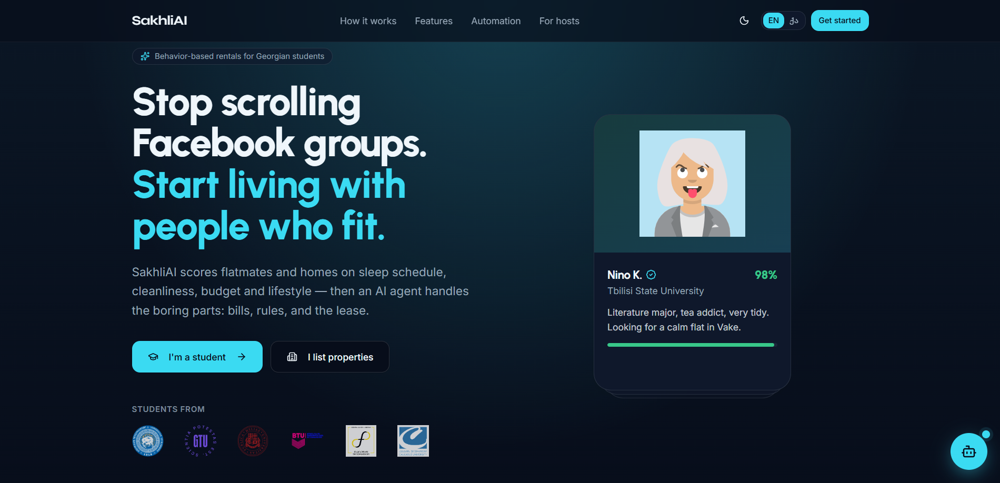

<div align="center">



# SakhliAI

**Behavior‑based flatmate matching & automated long‑term rentals for students in Georgia.**

[🚀 Live Demo](https://sakhli-ai.lovable.app) · [The story on LinkedIn](https://www.linkedin.com/posts/giorgi-shanidze_hackathon-startup-studenthousing-ugcPost-7472346468562071552-R93E/)

_“Sakhli” (სახლი) means “home” in Georgian — so SakhliAI is literally **Home + AI**._

</div>

---

## 💡 The idea

Finding student housing in Georgia today means endless scrolling through Facebook groups, moving in with a stranger and hoping it works out, then fighting over bills and chores for the rest of the lease. It’s a gamble.

**SakhliAI turns that gamble into a match.** Instead of pairing people on photos and price, it scores compatibility on the things that actually cause flatmate conflict — **sleep schedule, cleanliness, budget overlap, and lifestyle habits** — and then lets an AI agent handle the boring, friction‑filled parts of living together: splitting the bills fairly, mediating house rules, and preparing the lease.

For the people who own the apartments, SakhliAI is a **control center** that runs a hybrid short‑/long‑term rental on autopilot — one live calendar across Airbnb, Booking.com and student leases, AI rent pricing, automated cleaning, and smart‑lock codes, all kept in sync by **n8n** automations.

The whole product is built around one principle: **make the AI a visible character, not a hidden checkbox** — you can watch the agent and the automations work in real time.

---

## ✨ Features

### For students 🎓
- **Swipe‑to‑match discovery** — browse fit‑scored flatmates and homes like a feed; like, match, move in.
- **Transparent compatibility** — every match breaks down into sleep schedule, cleanliness, budget and lifestyle, so there’s no black box.
- **AI bill splitter** — pro‑rates every utility by who moved in when, and explains the reasoning in one line (_“Nino moved in 8 days late → pays less”_). Equal‑split mode included.
- **AI house‑rules mediator** — describe a disagreement (noise, guests, cleaning) and get a fair compromise drawn from both onboarding profiles.
- **Smart digital lease** — a clear bilingual lease generated for your match and signed in‑app, “secured in the SakhliAI Vault.”
- **Onboarding personality reveal** — a 2‑minute quiz turns into a “housing personality” card before you start matching.
- **Plans** — Free / Plus / Ultra with a localized checkout (TBC Bank / Bank of Georgia).

### For hosts 🏠
- **Unified live calendar** across Airbnb, Booking.com, direct and student channels.
- **AI rent predictor** — split‑season pricing for academic vs. tourist months.
- **Channel sync, cleaning ops & smart‑lock codes** — automated and orchestrated via n8n.
- **AI applicant screening** — tenant fit / churn‑risk analysis from real student profiles.
- **Live “Connected to n8n” activity** — see automations fire in real time.

### Throughout
- **Bilingual** — full English 🇬🇧 / Georgian 🇬🇪 (ქართული) support.
- **Light & dark themes**, motion‑rich UI, and a live **agent activity feed** that surfaces the automation story.

---

## 🛠️ Tech stack

| Layer | Tech |
| --- | --- |
| Framework | **React 19** + **TanStack Start** (SSR) + **TanStack Router** (file‑based) |
| Styling | **Tailwind CSS v4**, **shadcn/ui** (Radix), **framer-motion** |
| Type system | TypeScript |
| Backend | **Supabase** — Auth, Postgres (RLS), Realtime |
| Automation | **n8n** workflows (booking, cleaning, assistant, mediator webhooks) |
| Fonts | Syne (display/nav), Urbanist, Inter, Noto Sans Georgian |
| Tooling | Vite, ESLint, Prettier, Nitro |

---

## 🤖 How it was built

This project was built **during a [Vibe Coding Hackathon](https://www.linkedin.com/company/nakadi-hub) organized by [Nakadi Hub](https://www.linkedin.com/company/nakadi-hub)** — true to the spirit of vibe coding, it was assembled almost entirely with AI tooling:

- **[Lovable](https://lovable.dev)** — to scaffold the app, the UI, and the Supabase integration.
- **[n8n](https://n8n.io)** — for the agentic automations behind matching, bill‑splitting, applicant screening, channel sync, cleaning dispatch and smart‑lock rotation.
- **Various coding agents** — to refine the UI architecture and interaction logic, harden the auth/database flow, surface the AI/automation story, localize the app, and clean things up.

---

## 🚀 Getting started

> Requires **Node 20+** and a Supabase project.

```bash
# 1. Install dependencies
npm install

# 2. Create a .env at the project root and fill in your keys (see below)

# 3. Run the dev server
npm run dev
```

### Environment variables

```bash
# Supabase (client)
VITE_SUPABASE_URL=https://<project-ref>.supabase.co
VITE_SUPABASE_ANON_KEY=<anon-key>

# Supabase (server / admin — used for confirmed sign‑ups & n8n webhooks)
SUPABASE_URL=https://<project-ref>.supabase.co
SUPABASE_ANON_KEY=<anon-key>
SUPABASE_SERVICE_ROLE_KEY=<service-role-key>

# n8n
VITE_N8N_ASSISTANT_URL=<assistant-webhook-url>
VITE_N8N_MEDIATE_URL=<mediate-conflict-webhook-url>
N8N_WEBHOOK_SECRET=<shared-secret>   # optional, verifies inbound n8n calls
```

> ℹ️ Vite reads `.env` only at startup — **restart the dev server** after changing it.

### Database

The Postgres schema (tables, RLS policies, and the `handle_new_user` trigger) lives in [`supabase/migrations`](./supabase/migrations). Apply it to your Supabase project, then the app will create `profiles` / `users` rows automatically on sign‑up.

### Scripts

| Command | Description |
| --- | --- |
| `npm run dev` | Start the dev server |
| `npm run build` | Production build |
| `npm run preview` | Preview the production build |
| `npm run lint` | Run ESLint |
| `npm run format` | Format with Prettier |

### n8n webhook endpoints

The app exposes endpoints for n8n to push real‑time events into the Host dashboard:

- `POST /api/public/n8n/booking` — new booking / guest screening
- `POST /api/public/n8n/cleaning` — cleaning task dispatch

---

## 👥 Team

Built with ❤️ in Tbilisi by:

- **Giorgi Shanidze** — [@GeorgeShani](https://github.com/GeorgeShani)
- **Ani Pirosmanashvili** — [@anipiro](https://github.com/anipiro)

🏆 Created during a **Vibe Coding Hackathon** organized by **[Nakadi Hub](https://www.linkedin.com/company/nakadi-hub)**.

---

## 🔗 Links

- **Live demo:** https://sakhli-ai.lovable.app
- **Hackathon organizer:** [Nakadi Hub](https://www.linkedin.com/company/nakadi-hub)
- **Project story:** [LinkedIn post](https://www.linkedin.com/posts/giorgi-shanidze_hackathon-startup-studenthousing-ugcPost-7472346468562071552-R93E/)

---

<div align="center">
<sub>SakhliAI — smart rentals for Georgia 🇬🇪</sub>
</div>
